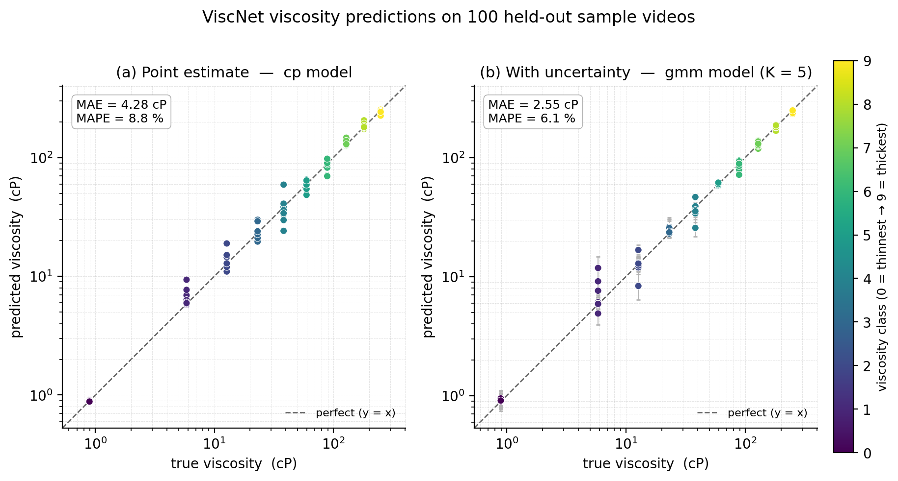

# Results — how well does it work?

This folder is the "did it actually work" view: the model's predictions on the 100
bundled sample videos, next to the true viscosity of each. **You do not need to run any
code to read this** — the numbers and the plot below tell the whole story.

## What the model is doing

Each video shows a fluid being stirred and then settling. Thin fluids (like water) slosh
and swirl quickly; thick fluids (like syrup) move sluggishly and calm down fast. ViscNet
watches that motion and predicts the fluid's **viscosity in centipoise (cP)** — water is
about 0.9 cP, thick syrup here is up to 250 cP.

## The plot



**How to read it:** each dot is one video. Its horizontal position is the *true* viscosity;
its vertical position is what the model *predicted*. The dashed line is perfect agreement —
**the closer a dot sits to that line, the more accurate the prediction.** Color just marks
how thick the fluid is (dark purple = thinnest, yellow = thickest). The right panel is the
uncertainty model: the grey bars show the model's own ±1σ confidence range for each video.

Almost every dot lands on or very near the line across the whole range, from 0.9 cP up to
250 cP — a factor of ~280 in viscosity — which is the visual version of the error numbers
below.

## The numbers

On these 100 sample videos:

| Model | Mean abs. error | Mean abs. % error |
|---|--:|--:|
| `cp` — point estimate | **4.28 cP** | **8.8 %** |
| `gmm` — with uncertainty | **2.55 cP** | **6.1 %** |

For reference, on the **full 1000-clip** held-out test set the same checkpoints score
**4.06 cP** (`cp`) and **2.39 cP** (`gmm`); the 100-clip sample here is a smaller subset,
so its numbers are close but not identical. The uncertainty (`gmm`) model is both more
accurate *and* tells you how confident it is.

## One clip per viscosity class

A representative video from each of the 10 viscosity levels (true value vs the two models'
predictions):

| class | true cP | `cp` pred | `gmm` pred | `gmm` ±σ (cP) |
|--:|--:|--:|--:|--:|
| 0 | 0.89 | 0.91 | 0.95 | ±0.14 |
| 1 | 5.84 | 6.92 | 7.61 | ±1.50 |
| 2 | 12.72 | 15.09 | 12.64 | ±1.43 |
| 3 | 23.10 | 22.64 | 23.99 | ±2.48 |
| 4 | 38.21 | 33.91 | 36.31 | ±4.11 |
| 5 | 59.53 | 54.59 | 59.32 | ±0.50 |
| 6 | 88.89 | 90.14 | 85.18 | ±0.37 |
| 7 | 128.52 | 126.69 | 130.20 | ±0.64 |
| 8 | 181.13 | 206.06 | 180.00 | ±1.22 |
| 9 | 250.00 | 231.23 | 233.01 | ±2.83 |

## Files here

| File | What it is |
|---|---|
| `parity.png` | the plot above |
| `predictions_cp.csv` | every clip's true vs predicted cP for the `cp` model |
| `predictions_gmm.csv` | same for the `gmm` model, plus the ±σ uncertainty band |
| `plot_results.py` (in `../scripts/`) | rebuilds `parity.png` from the two CSVs |

## Reproduce

The predictions were produced by running the bundled models over the sample clips on a
GPU (`torch==2.5.1`, CUDA); the CSVs and figure are regenerated with:

```bash
python infer.py --model cp  --out results/predictions_cp.csv
python infer.py --model gmm --out results/predictions_gmm.csv
python scripts/plot_results.py            # -> results/parity.png
```
